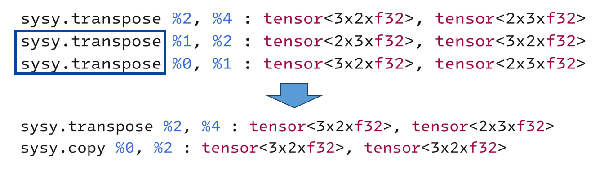
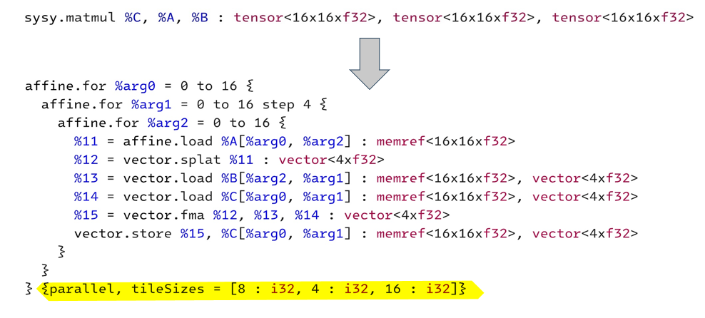
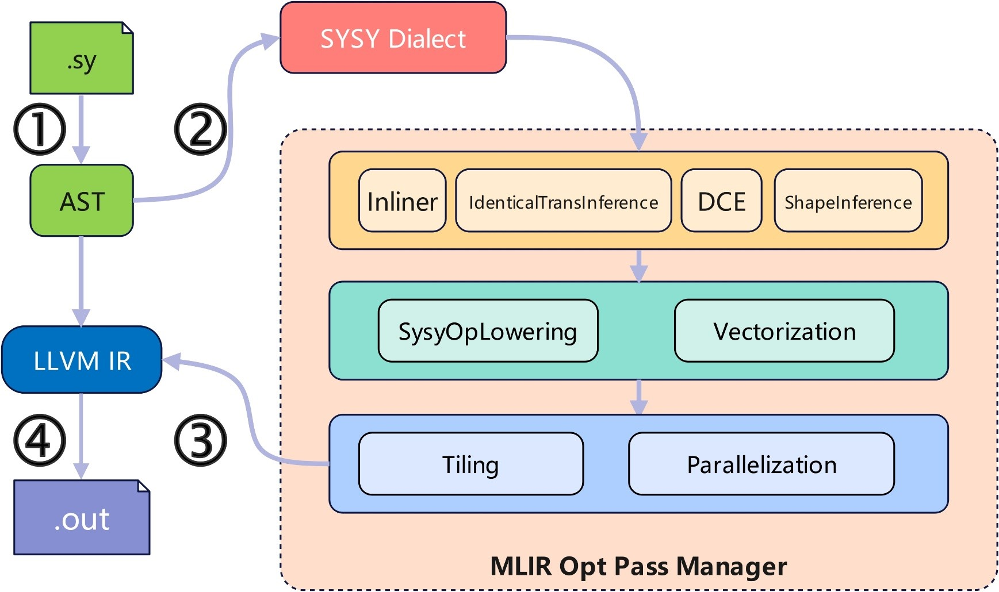
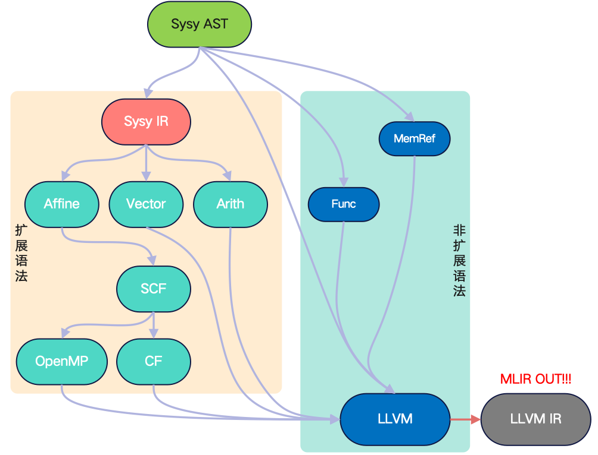
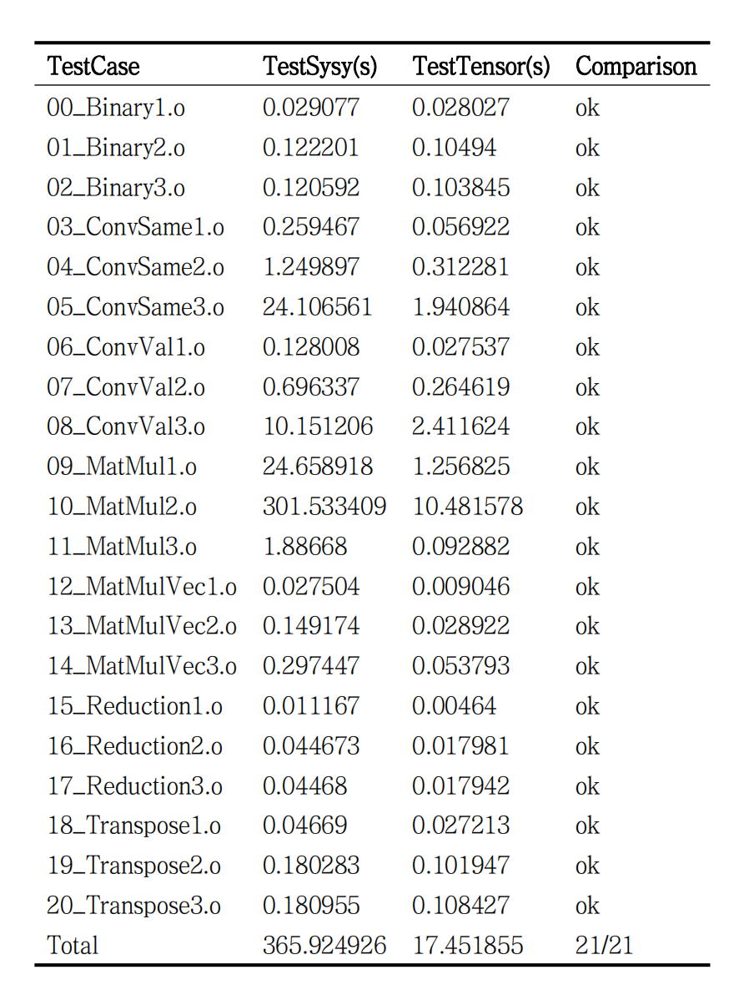
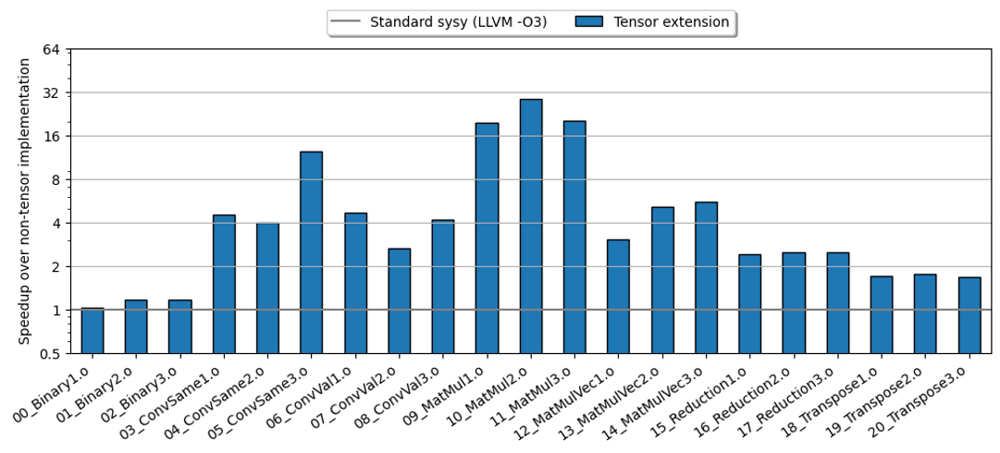
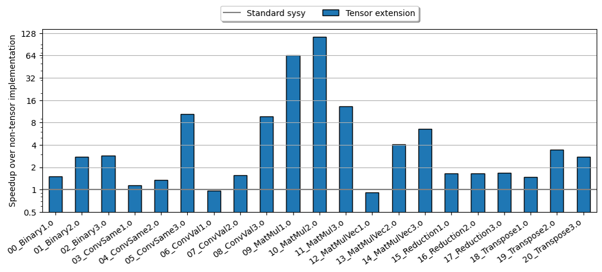
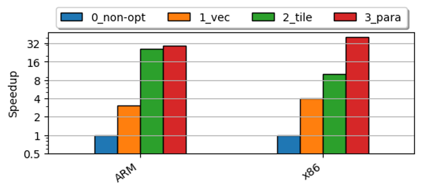
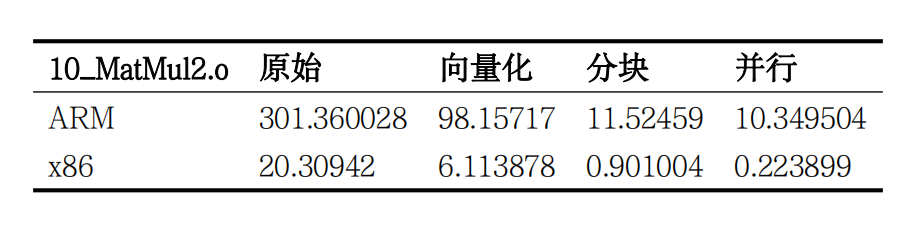

# 技术报告
## 编译器简介
SysY Parallel Compiler (sysypc) 是一款专为 SysY 2022 语言设计的编译器，旨在支持并行优化和高效代码生成。该编译器的前端由 ANTLR 4 实现，能够将源代码解析并转换为抽象语法树 (AST)。sysypc 利用多级中间表示框架 (MLIR) 的逐层降级能力，根据 SysY 2022 语言的扩展张量语法和非扩展语法部分，采用不同的降级路线对代码进行优化，最终生成 LLVM IR 和可重定位的目标文件。在编译的最后阶段，sysypc 使用标准链接器将生成的代码与 SysY 和 OpenMP 运行时库链接，生成最终的可执行目标程序。

sysypc 不仅支持 SysY 语言的基本功能，还通过 MLIR 的灵活性增强了对并行编程模式的支持，使得开发者能够更好地利用多核处理器的计算能力。此外，通过集成 LLVM 后端，sysypc 能够生成高效、可移植的机器代码，适用于多种目标平台。

## 语法扩展-Tensor

### sysy原有文法描述  
详见[sysy语言定义](SysY2022语言定义-V1.pdf)

### 如何实现并行扩展

常见的并行扩展方式包括：库的方式扩展Pthread、Directive方式扩展OpenMP、语言扩展的方式扩展OpenCik。相比于库方式扩展和Directive方式扩展，语言扩展方式能够提供更多的语义。如今，张量在机器学习和科学计算等领域广泛使用，利用张量的维度信息以及内联操作的语义信息指导优化。因此，本编译器采用 **扩展语言基本类型** 的的方式对语言进行并行扩展。

### Tensor扩展

对于原有的sysy语法进行张量扩展，具体如下：

扩展的Sysy语法：

```
bType :  'int' | 'float' | 'tensor' ;
funcDef : funcType Identifier '(' (funcFParams) ? ')' block ;
funcType : 'void' | 'int' |'float' |'tensor' ;
```

具体使用：

1. 新增tensor变量,可以对其声明和初始化  

```
tensor a[3][3] = {{1, 1, 1}, {2, 2, 2}, {3, 3, 3}};
tensor b[2][2];
tensor c;
```

2. 以内建函数的形式，支持对tensor的一系列操作  

- 简单操作

```
//拷贝
__copy(b, a);

//tensor逐元素的四则运算
__add(c, a, b);
__sub(c, a, b);
__mul(c, a, b);
__div(c, a, b);
      

//转置
//需要a，b的维数相对应，或者不显式指定维度
//高维之支持按顺序反转，如abcd到dcba
__transpose(b, a);

//规约
__max(c);
__min(c);
__sum(c);

//tensor内逐元素清0
 __clear(a);
```
- 高级操作
```
//tensor乘法（矩阵乘）
__matmul(c, a, b);

//卷积
//无填充
__conv_valid(c, a, b);
//有填充，卷积后维数不变
__conv_same(c, a, b);
 
//ReLU激活函数
__relu(b,a);
 
//最大池化
__maxpool(c,a,b);
 
 
//展平
__flatten(b,a);
 
//全连接
__fc(b,a,weight,bias);
 
```
- 其他
```
//tensor的输入输出
gettensor(a);
puttensor(a);
```

​    3. 还支持自定义带有tensor类型参数的函数

```
//例如
void addOrSub(tensor a, tensor b, tensor c, int x){
if(x)
    __add(c, a, b);
else
    __sub(c, a, b);
return;
}

int main(){
tensor a[2][3] = {{0, 2, 3}, {4, 5, 6}};
tensor b[2][3] = {{1, 2, 3}, {4, 5, 6}};
tensor c[2][3];
int x = getint();
addOrSub(a, b, c, x);
puttensor(c);
return 0;
}
```

### Tensor扩展带来的优势

#### 简化编程

通过扩展Tensor支持，SYSY可以提供更简洁的语法，使得一些针对多维数据的常见操作变得更加自然。这样可以减少错误，提高代码可读性，并加快开发过程。例如，对卷积的使用，在原SYSY下写法如下：

```
void conv_valid(float result[][385], float input[][512],float kernel[][128], int result_row, int result_column, int k_row, int k_column) {
	int i=0,j,k,l;

    while(i<result_row){
        j=0;
        while(j<result_column){
            result[i][j] = 0.0;
            k=0;
            while(k<k_row){
                l=0;
                while(l<k_column){
                    result[i][j] = result[i][j] +  input[i+k][j+l] * kernel[k][l];
                    l=l+1;
                }
                k=k+1;
            }
            j=j+1;
        }
        i=i+1;
    }
}

int main()
{
    float input[512][512],kernel[128][128],result[385][385];
    int in_row = 512, in_column = 512, k_row = 128, k_column = 128;
    int r_row = in_row - k_row + 1;
    int r_column = in_column - k_column + 1;

    //getfarray(input);
    //getfarray(kernel);

    int i=0,j=0;
    while(i<in_row){
        j=0;
        while(j<in_column){
          input[i][j] = getfloat();
          j=j+1;
        }
        i=i+1;
    }

    i=0;
    while(i<k_row){
        j=0;
        while(j<k_column){
            kernel[i][j] = getfloat();
            j=j+1;
        }
        i=i+1;
    }

    conv_valid(result,input,kernel,r_row,r_column,k_row,k_column);


    return 0;

}
```

相反，扩展Tensor后实现卷积只需要 一行

```
int main()
{
    tensor input[512][512];
    tensor kernel[128][128];
    tensor result;
    gettensor(input);
    gettensor(kernel);
    __conv_valid(result, input, kernel);
    return 0;
}
```

#### 通过操作提供语义信息指导代码变换

- 冗余删除：通过提供了对张量类型操作的意义抽象，在Sysy方言这个层次中能够发现冗余操作并及时消除。

  

- 保证激进优化的正确性：张量类型本身也携带了语义，对于特定的目标平台，微内核的大小总是固定的。然而当矩阵规模过小时则会访存越界，利用张量的形状信息，我们能够保证我们变换后代码的正确性。

​	

## 编译器实现方法

### 架构概述
本项目使用ANTLR 4实现了前端，完成源代码到AST的转换。利用MLIR逐层降级的能力对SysY 2022的扩展语法和非扩展语法部分使用不同的降级路线对代码进行优化并生成LLVM IR以及可重定位目标文件。最后使用普通的链接器完成SysY和OpenMP运行时库链接生成可执行目标程序。 




### 前端
1. 词法分析 & 语法分析  
    使用Antlr库对sysy语言进行分析抽象，生成相应的抽象语法树
2. 语义分析  
    遍历语法树生成对应的MLIR  
（本编译器还实现了从语法树直接生成llvmIR，为后续消融实验提供环境）


### 中间表示
在降级到通用的IR之前，使用mlir提供的框架生成前置IR，以达到在降级前保留一些信息的目的，可以针对不同的操作执行定制化的优化
- 从AST降级到MLIR  
对于非扩展语法的AST节点，sysypc会将它们直接降级到LLVM方言中的操作；对于扩展语法的AST节点，sysypc会将它们降级到定义的sysy方言的操作中。初步降级后的AST是一个混合着LLVM方言和sysy方言的MLIR表示。


- MLIR内部优化  
对于使用sysy方言的操作，进行操作相关的程序结构优化以及向量化并行化。在降级到现有方言之前应用了操作相关的自定义优化。同时将sysy方言逐层降级到现有方言后启用了现有方言中的优化pass。充分利用逐层降级过程中保存下来的语言特性，以及现有的工具。

详细降级过程见[SysyMLIR扩展](./SysyMLIR.pdf)

### 后端
使用llvm后端工具链，版本为llvm-17.0.6  
编译选项如下：

```
Usage: ./sysypc [options] <input_file>
Options:
  -o <file>    Specify output file (default: output to console)
  -m           Output mixed MLIR instead of object file
  -l           Output LLVM dialect instead of object file
  -L           Output LLVM IR instead of object file
  -O<level>    Set llvm optimization level (0, 1, 2, 3, default: 0)
  -a           Compile for ARMv7 architecture
  -h           Display this help message
```

## 测试
### 测试环境
- 硬件环境：

    ```
    X86平台：Intel 12th i5 + 32G RAM
    ARM平台：树莓派，4核ARMv8 cortex a72处理器 + 4G RAM
    ```

- 软件环境

  ```
  Ubuntu 22.04
  LLVM 17.0.6
  ANTLR 4
  ```

### 测试用例

测试用例的选取分四类：
- 常规功能测试和性能测试：测试编译器完整性，测试样例总共235个。  
[2023年实现赛公开样例](https://gitlab.eduxiji.net/csc1/nscscc/compiler2022/-/tree/master/%E5%85%AC%E5%BC%80%E6%A0%B7%E4%BE%8B%E4%B8%8E%E8%BF%90%E8%A1%8C%E6%97%B6%E5%BA%93)
- 张量功能测试：测试新增张量类型后的功能是否可用，测试样例总共23个。  
[tensor的测试用例]  （../test/testcase/tensor）
- 张量性能测试：保证同样功能的前提下，对标量的程序进行张量的改写，测试样例42个。  
  [新写的tensor和标量的用例]   (../test/testcase/TestTensor)  (../test/testcase/TestSysy)
- 此外，实验中挑选上届实现赛获奖参赛队伍的编译器作为对比，在参赛队伍中选取排名靠前且公开代码可以运行的三组，分别是：
  - 一等奖：[ATRI](https://gitlab.eduxiji.net/educg-group-18973-1895971/202310006201725-78)  branch:origin/develop
  - 二等奖：[卷涡鸣人](https://gitlab.com/YfsBox/Compiler2023-yfscc.git) branch:7_29_version
  - 三等奖：[XFD（已经摆烂）](https://gitlab.eduxiji.net/educg-group-18973-1895971/202310246201891-3670) branch:origin/daz_new_merge


### 测试结果
1. 所有测试用例全部通过。
2. 性能测试的执行时间

- ARM性能

  | **Performance**                 | **Time(s)** | **Comparison** |
  | ------------------------------- | ----------- | -------------- |
  | 00_bitset1.o                    | 0.4036      | ok             |
  | 00_bitset2.o                    | 0.775       | ok             |
  | 00_bitset3.o                    | 1.1797      | ok             |
  | 01_mm1.o                        | 4.793       | ok             |
  | 01_mm2.o                        | 4.8924      | ok             |
  | 01_mm3.o                        | 3.8339      | ok             |
  | 02_mv1.o                        | 3.4989      | ok             |
  | 02_mv2.o                        | 1.3262      | ok             |
  | 02_mv3.o                        | 2.2899      | ok             |
  | 03_sort1.o                      | 0.5711      | ok             |
  | 03_sort2.o                      | 9.2798      | ok             |
  | 03_sort3.o                      | 1.8324      | ok             |
  | 04_spmv1.o                      | 2.1206      | ok             |
  | 04_spmv2.o                      | 1.6218      | ok             |
  | 04_spmv3.o                      | 0.7805      | ok             |
  | brainfuck-bootstrap.o           | 8.5426      | ok             |
  | brainfuck-mandelbrot-nerf.o     | 42.5764     | ok             |
  | brainfuck-pi-nerf.o             | 2.1493      | ok             |
  | conv0.o                         | 5.705       | ok             |
  | conv1.o                         | 9.1588      | ok             |
  | conv2.o                         | 5.4806      | ok             |
  | crypto-1.o                      | 0.6261      | ok             |
  | crypto-2.o                      | 0.5135      | ok             |
  | crypto-3.o                      | 0.6792      | ok             |
  | dead-code-elimination-1.o       | 0           | ok             |
  | dead-code-elimination-2.o       | 0.0001      | ok             |
  | dead-code-elimination-3.o       | 0.0091      | ok             |
  | fft0.o                          | 2.6708      | ok             |
  | fft1.o                          | 5.7422      | ok             |
  | fft2.o                          | 5.4699      | ok             |
  | floyd-0.o                       | 0           | ok             |
  | floyd-1.o                       | 0.0037      | ok             |
  | floyd-2.o                       | 1.9097      | ok             |
  | gameoflife-gosper.o             | 12.1637     | ok             |
  | gameoflife-oscillator.o         | 10.825      | ok             |
  | gameoflife-p61glidergun.o       | 10.738      | ok             |
  | hoist-1.o                       | 0.0006      | ok             |
  | hoist-2.o                       | 0.5561      | ok             |
  | hoist-3.o                       | 5.5603      | ok             |
  | instruction-combining-1.o       | 0           | ok             |
  | instruction-combining-2.o       | 0.0002      | ok             |
  | instruction-combining-3.o       | 0.0002      | ok             |
  | integer-divide-optimization-1.o | 0.0002      | ok             |
  | integer-divide-optimization-2.o | 0.109       | ok             |
  | integer-divide-optimization-3.o | 1.7421      | ok             |
  | median0.o                       | 1.5874      | ok             |
  | median1.o                       | 0.0013      | ok             |
  | median2.o                       | 8.4536      | ok             |
  | shuffle0.o                      | 8.7077      | ok             |
  | shuffle1.o                      | 10.0179     | ok             |
  | shuffle2.o                      | 2.4466      | ok             |
  | sl1.o                           | 2.7904      | ok             |
  | sl2.o                           | 1.0818      | ok             |
  | sl3.o                           | 0.5102      | ok             |
  | stencil0.o                      | 0.0439      | ok             |
  | stencil1.o                      | 0.0901      | ok             |
  | transpose0.o                    | 3.1902      | ok             |
  | transpose1.o                    | 3.1117      | ok             |
  | transpose2.o                    | 9.4207      | ok             |
  | Total                           | 223.5845    | 59/59          |

- ARM最终性能

  | **Final Performance**     | **Time(s)** | **Comparison** |
  | ------------------------- | ----------- | -------------- |
  | 01_mm1.o                  | 4.9371      | ok             |
  | 01_mm2.o                  | 4.7642      | ok             |
  | 01_mm3.o                  | 3.7392      | ok             |
  | 03_sort1.o                | 0.5706      | ok             |
  | 03_sort2.o                | 9.2871      | ok             |
  | 03_sort3.o                | 1.8396      | ok             |
  | 04_spmv1.o                | 2.0765      | ok             |
  | 04_spmv2.o                | 1.4473      | ok             |
  | 04_spmv3.o                | 0.7754      | ok             |
  | fft0.o                    | 2.6317      | ok             |
  | fft1.o                    | 5.7824      | ok             |
  | fft2.o                    | 5.4671      | ok             |
  | gameoflife-gosper.o       | 12.2814     | ok             |
  | gameoflife-oscillator.o   | 10.7525     | ok             |
  | gameoflife-p61glidergun.o | 11.0459     | ok             |
  | if-combine1.o             | 3.617       | ok             |
  | if-combine2.o             | 5.4241      | ok             |
  | if-combine3.o             | 9.0777      | ok             |
  | large_loop_array_1.o      | 1.7943      | ok             |
  | large_loop_array_2.o      | 3.4424      | ok             |
  | large_loop_array_3.o      | 1.3784      | ok             |
  | matmul1.o                 | 5.7191      | ok             |
  | matmul2.o                 | 5.7169      | ok             |
  | matmul3.o                 | 5.7166      | ok             |
  | recursive_call_1.o        | 9.0306      | ok             |
  | recursive_call_2.o        | 2.2619      | ok             |
  | recursive_call_3.o        | 4.5276      | ok             |
  | shuffle0.o                | 9.9104      | ok             |
  | shuffle1.o                | 9.9882      | ok             |
  | shuffle2.o                | 2.5067      | ok             |
  | sl1.o                     | 2.8021      | ok             |
  | sl2.o                     | 1.1087      | ok             |
  | sl3.o                     | 0.5099      | ok             |
  | transpose0.o              | 3.3333      | ok             |
  | transpose1.o              | 3.1908      | ok             |
  | transpose2.o              | 9.456       | ok             |
  | Total                     | 177.9106    | 36/36          |

经测试，优化前后，我们的编译器性能都远高于上届获奖参赛队伍的编译器。

## 优化效果
### 优化执行时间
1. 标量功能  
2. 张量功能 
3. 同编译器下的张量优化

#### ARM平台 优化前后





#### X86平台 优化前后





### 消融实验
总的来说，我们在MLIR这层运用了循环分块，并行化，向量化的优化技术，对每一部分的影响进行分析（以**矩阵乘**为例）
- 未优化前运行时间
- 添加循环分块后
- 并行化后
- 向量化后






## 附录（开源库的使用）

ANTLR14，LLVM17，以及与LLVM17配套的MLIR和OpenMP库